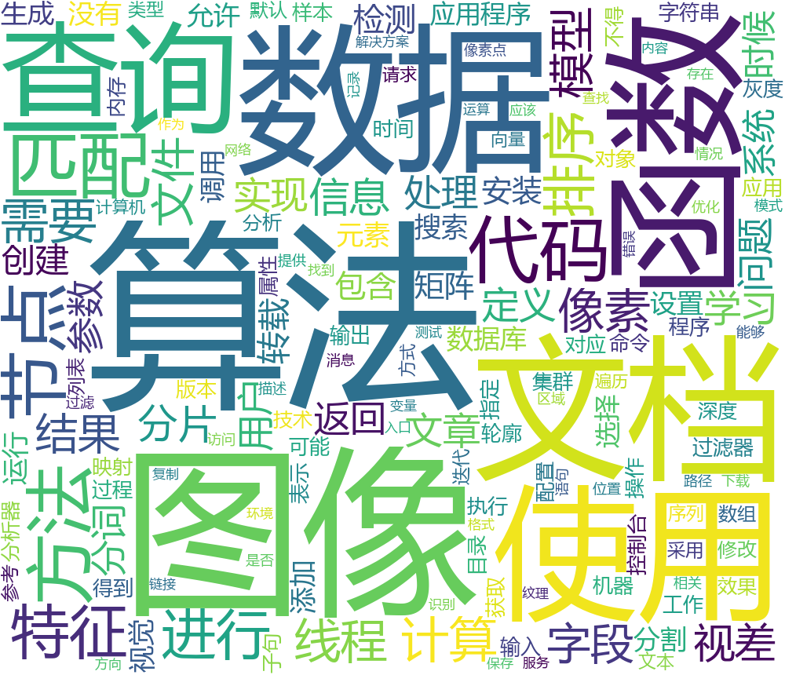
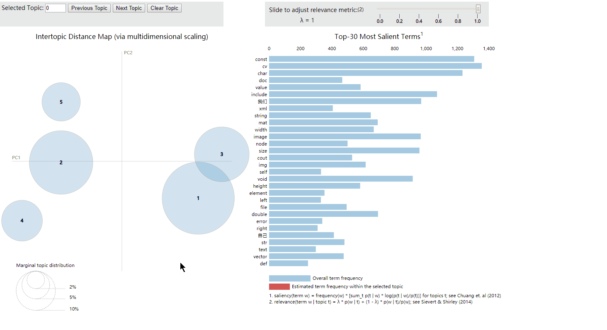
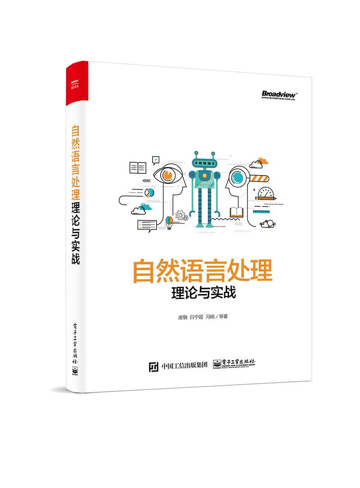
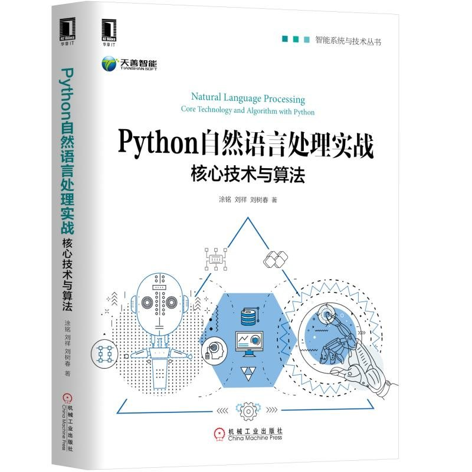
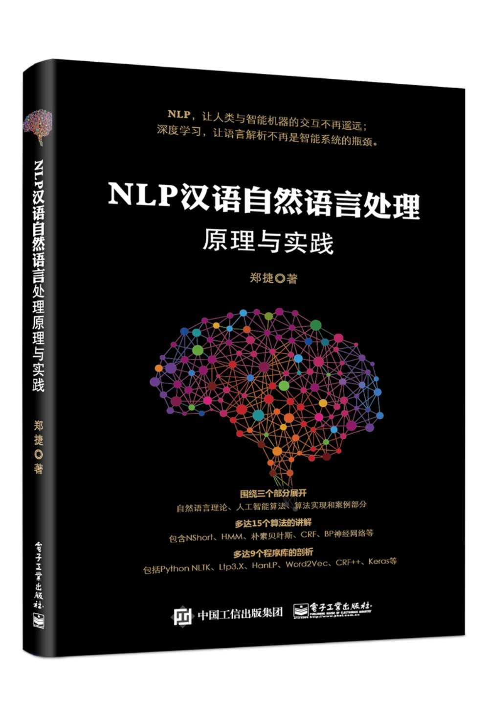
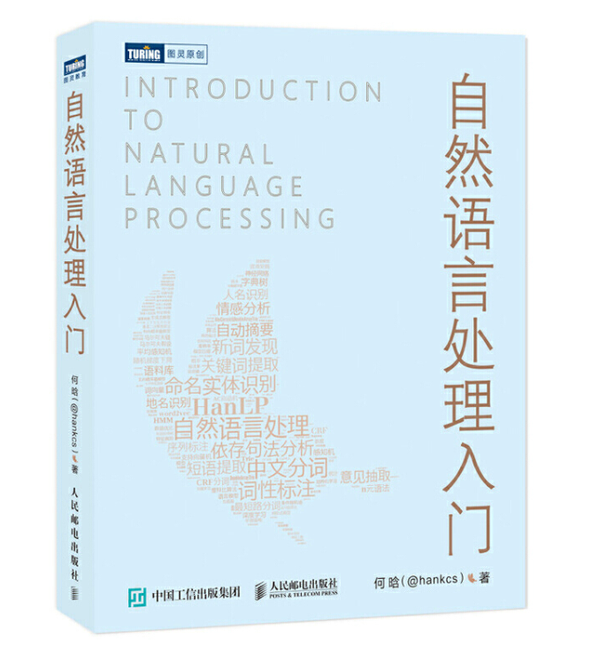

# Contents  

- [简介](#简介) 
- [Video_Course](#Video_Course)
- [语料与爬虫](#语料与爬虫) 

# 简介
NLP_DEMO
NLP Common Analytical Ideas

# 视频课程
Video_Course

免费视频课程链接：[自然语言处理实战入门](https://edu.csdn.net/course/detail/20769)

随着人工智能的快速发展，自然语言处理和机器学习技术的应用愈加广泛。
要想快速入门这些前沿技术总是存在着各种各样的困难.
本教程力求为同学们对该领域整体概况有一个明晰的认识，并选择网络爬虫，汉语分词，可视化，文本分类等几个常见的应用领域和场景进行基于python语言的实战化入门介绍。

With the rapid development of artificial intelligence, the application of natural language processing and machine learning technology is more and more extensive. 
In order to get a quick start to these frontier technologies, there are always various difficulties. 
This tutorial aims to give students a clear understanding of the overall situation in this field, and select several common application fields and scenarios, such as web crawler, Chinese word segmentation, visualization, text categorization and so on, for a practical introduction based on Python language. 

---

# 前置技术

- 正则表达式
- 网络爬虫
- 传统机器学习算法
- 深度学习算法

---

# 爬虫与语料积累
Corpus_Accumulation--spider

- [简单NLP分析套路（1）----语料库积累之3种简单爬虫应对大部分网站](https://blog.csdn.net/wangyaninglm/article/details/83479837)

- [《自然语言处理实战入门》 ---- 第2课 ：网络爬虫简介](https://blog.csdn.net/wangyaninglm/article/details/89007652)

- [《自然语言处理实战入门》 ---- 第3课 ：本人CSDN博客的爬取](https://blog.csdn.net/wangyaninglm/article/details/89440922)

---

# NLP基础分析
Basic Analysis Route of Chinese NLP

[简单NLP分析套路（2）----分词，词频，命名实体识别与关键词抽取](https://blog.csdn.net/wangyaninglm/article/details/84504101)

[《自然语言处理实战入门》 ---- 第4课 ：中文分词原理及相关组件简介](https://season.blog.csdn.net/article/details/90587705)

---

# 可视化与语料库
Visual presentation and corpus collection

[简单NLP分析套路（3）---- 可视化展现与语料收集整理](https://blog.csdn.net/wangyaninglm/article/details/84901376)

## wordcloud

* 以下是使用结巴分词器TF-IDF 关键词抽取算法抽取的词云

* 以下是使用mask 图像使用ltp 分词器跑出的分词结果生成的词云

## LDA

## 综合可视化

- [卅年春秋，谁主沉浮？从400篇任正非演讲稿分析中，一探华为](https://mp.weixin.qq.com/s?__biz=MjM5MTQzNzU2NA==&mid=2651670909&idx=1&sn=d690d8efa7237594312c6ee7c3741312&chksm=bd4c6eee8a3be7f8f39240a6c4fd1d04f26dfb0a9af6644e1d5acd13974d0b5d2e79f025c33b&mpshare=1&scene=23&srcid=#rd)
- [天池可视化教程](https://tianchi.aliyun.com/course/courseDetail?spm=5176.12282042.0.0.5bb52042TuqOqk&courseId=261)

## 语料库

- [《自然语言处理实战入门》 ---- 第5课 ：分词评测及语料库简介](https://season.blog.csdn.net/article/details/89820033)

----

# 句法分析

----

# 情感倾向性分析

- [如何用Python做情感分析？](https://www.jianshu.com/p/d50a14541d01)

- [SnowNLP: Simplified Chinese Text Processing](https://github.com/isnowfy/snownlp)

-----------

# 机器翻译

[机器翻译：统计建模与深度学习方法](https://opensource.niutrans.com/mtbook)

----------

# 问答机器人

- [自己动手做聊天机器人](http://www.shareditor.com/bloglistbytag/?tagname=%E8%87%AA%E5%B7%B1%E5%8A%A8%E6%89%8B%E5%81%9A%E8%81%8A%E5%A4%A9%E6%9C%BA%E5%99%A8%E4%BA%BA)

- [《智能问答与深度学习》](https://github.com/111x0m7/book-of-qna-code/)

- [保险领域智能问答](https://github.com/Samurais/insuranceqa-corpus-zh)

# 知识图谱

- [这是一份通俗易懂的知识图谱技术与应用指南](https://www.jiqizhixin.com/articles/2018-06-20-4)

- [以疾病为中心的医药领域知识图谱，并完成自动问答与分析服务](https://github.com/liuhuanyong/QASystemOnMedicalKG)

- [开放的中文知识图谱](http://openkg.cn/home)

- [医学知识图谱](http://zstp.pcl.ac.cn:8002/)

# 文本搜索

# 智能问答

# 文本生成

[只需单击三次，让中文GPT-2为你生成定制故事](https://www.jiqizhixin.com/articles/2019-11-12-11)

----

# 参考书籍与资源

- [做项目一定能用到的NLP资源](https://blog.csdn.net/wangyaninglm/article/details/88287283)

- [《自然语言处理理论与实践》](https://github.com/bainingchao/NLP-ML)

[配套代码：https://github.com/bainingchao/NLP-ML](https://github.com/bainingchao/NLP-ML)

- [Python自然语言处理实战-核心技术与算法](https://github.com/nlpinaction/learning-nlp)

[配套代码：https://github.com/nlpinaction/learning-nlp](https://github.com/nlpinaction/learning-nlp)

- NLP汉语自然语言处理原理与实践

- [自然语言处理入门](https://github.com/hankcs/pyhanlp/tree/master/tests/book)

----

# 致谢

排名不分先后，本github 参照了众多网上，书上，论文上的代码，图片，如有侵权请联系删除，非常感谢提供给资源的各个
网站，公众号，老师。

- [王树义老师](https://www.jianshu.com/u/7618ab4a30e4)

----

# 最新热点跟踪
 
- [放弃幻想，全面拥抱Transformer：自然语言处理三大特征抽取器（CNN/RNN/TF）比较](https://zhuanlan.zhihu.com/p/54743941)

- [2018年自然语言处理值得关注的研究、论文和代码](https://mp.weixin.qq.com/s?__biz=MzI0NTE4NjA0OQ==&mid=2658359531&idx=1&sn=95301e271308417978314f3e70ce1c7d&chksm=f2d59385c5a21a93b73a267a1055f221c1a4cf53077a0b125a521386ce670a6b9747123af360&mpshare=1&scene=1&srcid=0114aVegwPmpQnjtXPBupwDa#rd)

- [百度ERNIE](https://github.com/PaddlePaddle/ERNIE)